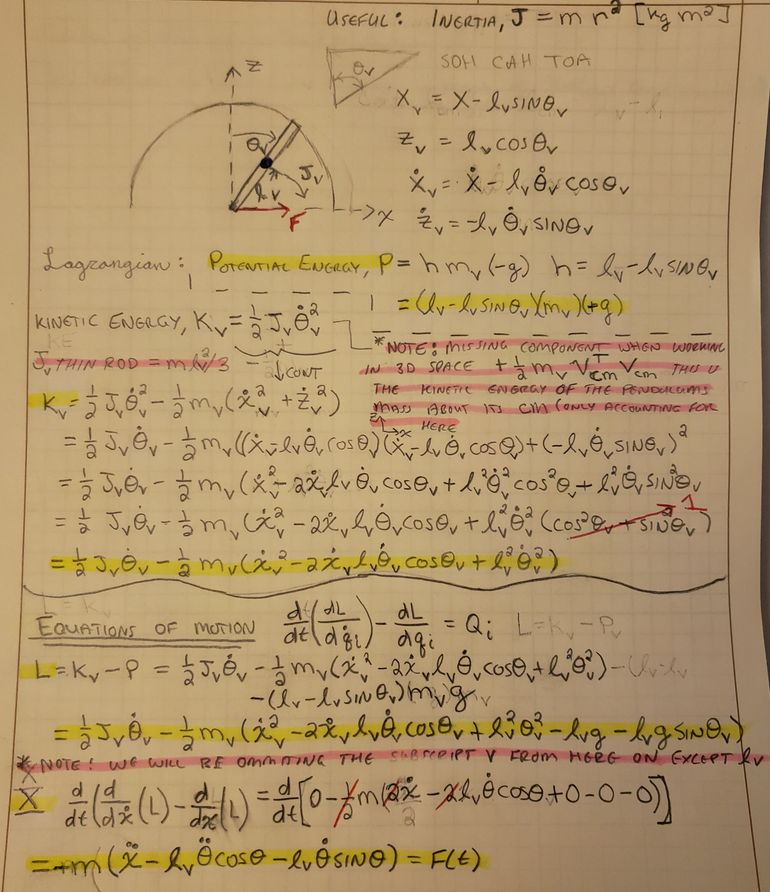
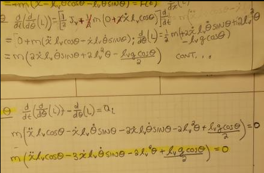

# MECA482-Group7-Project
[https://github.com/Toto245/Toto245.github.io] to view github.io 

 - Spring 2022 
 - Control System Design of Furuta Pendulum  
 - Group 7: Bryce Miller, Toto Albano-Dito, Angel Sanchez, Lucas West 

## Table of Context
+ [1 - Introduction](#Introduction) 
+ [2 - Modeling](#Modeling)
+ [3 - Preliminary Calculations](#Preliminary-Calculations)
+ [4 - Controller Design and Simulation](#Controller-Design-and-Simulation)
+ [5 - Conclusion](#Conclusion)
+ [6 - References](#References)

------------------------------------------------------------------------------------------------------
### Introduction

#### Project
The Furuta Pendulum (rotational inverted pendulum) is a device that balances a free rotating pendulum in the vertical plane by a drive arm which rotates in the horizontal plane. The goal of this project is to create a Furuta Pendulum simulation by creating a control algorithm through matlab and modeling on Coppelia Sim. The Pendulum beam will be balanced upright perpendicular to the base of the ground by a control system. the project will be virtual and not an actual product will be made. 

#### Deliverables 
- The team is expected to present their project (~ 5mins) and build a web page which contains all deliverables in GitHub.
- The mathematical model of the system must be delivered -preferably in Python or MATLAB.
- The control system should be provided preferable in Simulink, State-flow, or with a high-level
  programming language (e.g., C, C++, or Python). However, the team must show that the control algorithm will 
  give the design requirements for the target system. In other words, one cannot
  build the system solely hands-on approach similar to the videos below:
  o Pan and Tilt Mechanism
- The system will have a simulation with the control system and mathematical model by
  connecting Coppelia Sim to MATLAB, Simulink, or whatever the programming landscape is used.
- If the system contains hardware, the design of hardware should consist the necessary
  architectural explanations such as hardware and software relationships.

----------------------------------------------------------------------------------------------------
### Modeling

#### Logical Viewpoint
"describes the logical structure and the distribution of responsibilities functionality of a system by means of a network of interacting logical components that are responsible for a set of functions." Operator will start the process, this will send an input to the main logic controller, causing a signal to be sent to the driver that’s turning on the motor and making it spin. Feedback is then received on the position of the arm and corrections are made by the logic controller.

#### Operational Viewpoint
Visiual representation of our ststem and description of how the the physical components of our sysrem interacts with each other. our pendulum is controled by one gear arm which rotates on the horizontal plan to suppor t hte free rotating pedulum on the vertical plan. everything is supported by the base chassis.

----------------------------------------------------------------------------------------------------
### Preliminary Calculations

Figure 1. System Model

The futura pendulum system model is shown above. The moving arm utilizes the SRV02, which is the Quanser QUBE-Servo 2. This is how the arm actuates.

Variables of Figure 1.
- Lr = arm length
- Jr = Moment of Inertia
- θ = Angle of Jr
- Lp = Total Length
- Lp/2 = Center of Mass
- Jp = Moment of Inertia of the Center of Mass
-
The first step in the preliminary analysis was to build our State Space model. From this we were able to build the equations of motion for the pendulum by correctly relating the reactions in the state space model. Once the Equations of motion were built, it proved challenging to correctly build the State Space Equations. 

Link: https://github.com/Toto245/Toto245.github.io/tree/main/PrelimCalc

----------------------------------------------------------------------------------------------------
### Controller Design and Simulation 

#### MATLAB Code
Link https://github.com/Toto245/Toto245.github.io/tree/main/MATLABCode

#### CoppeliaSim 
Figure 1. CoppeliaSim Model

The modelling of the Furuta Pendulum is implemented with CoppeliaSim, which has the ability to compute dynamic properties needed in operation of the pendulum arm.

----------------------------------------------------------------------------------------------------
### Conclusion

We were able to obtain our preliminary equations of motion through calculations. Building the state equations from these motion equations was one roadblock for us in completing this project. From coding with matlab we were able to get root locus, plots and transfer functions all running. We were also able to build a mostly working model in copelia sim even though we were provided a model. In the end we were not able to get matlab and simulink to interact with eachother or run a simulation of the pendulum. 
----------------------------------------------------------------------------------------------------
### Appendix A

#### Capabilities Database

#### Task Planner 

#### Images file 
link: https://github.com/Toto245/Toto245.github.io/tree/main/images

----------------------------------------------------------------------------------------------------
### References 
1) https://www.youtube.com/watch?v=o5g-lUuFgpg 
2) https://en.wikipedia.org/wiki/Furuta_pendulum
3) Hernández-Guzmán Victor Manuel., & Silva-Ortigoza Ramón. (2019). Automatic control with experiments. Springer International Publishing.

